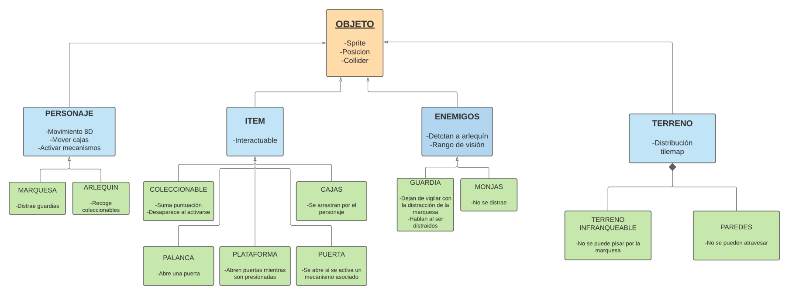
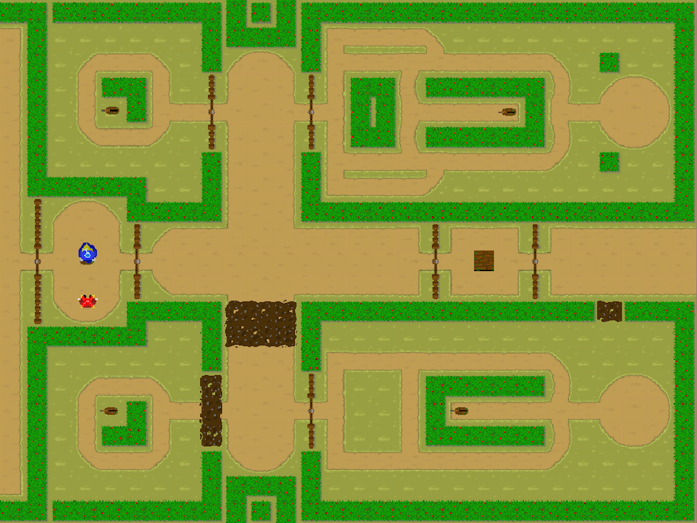

# Escape From Marquis' Manor

#### Equipo de desarrollo: Los Farsantes
  - Alberto Muñoz Fernández
  - Oscar García Castro
  - Liyuan Li
  - Javier Lagares Navas

##### Enlace al repositorio
https://github.com/albemu07/albemu07.github.io

##### Enlace al juego
https://albemu07.github.io/

##### Enlace a nuestro pivotal tracker
https://www.pivotaltracker.com/n/projects/2470813

# GDD

## **Escape From Marquis&#39; Manor**

**Documento de diseño de videojuego**

Equipo: _Los Farsantes_

Versión 2.0 - 17 de enero de 2021

| **Resumen** |
| --- |
| **Géneros:** Puzzle, Sigilo, Cooperativo, Top-Down 2D | **Modos:** 1 o 2 jugadores |
| **Público objetivo:**
 Todos los públicos | **Plataformas:** Internet |
| **Características:** Vista cenital, sigilo | **Arquitectura:** [https://lucid.app/lucidchart/31d52306-a374-46da-83ad-e7ff23a8ec8b/edit](https://lucid.app/lucidchart/31d52306-a374-46da-83ad-e7ff23a8ec8b/edit) |

## **Descripción**

&quot;Escape from Marquis&#39; Manor&quot; se basa en la obra de teatro &quot;La Marquesa Rosalinda&quot; de Ramón María del Valle-Inclán. La marquesa tiene una aventura con el Arlequín de un grupo de farsantes que se hospeda en las tierras de su marido. Celoso, el marqués planea contratar unos matones para deshacerse de él. Marquesa y Arlequín deberán colaborar para escapar de sus tierras antes de que esto ocurra. ¿Lo conseguirán?

#### **Aspectos generales**

Los jugadores controlan al Arlequín y a la Marquesa, intentando escapar de las laberínticas tierras del marqués y sus vigilantes. En ellas tendrán que interactuar con diferentes mecanismos y objetos para abrirse paso y llegar hasta el final. Los niveles se desarrollarán por los distintos parajes de la obra compuestos por puzzles que desafiarán a los jugadores y les obligarán a cooperar para avanzar. La recolección de ciertos objetos especiales otorgará un bonus en la puntuación que obtenga el jugador.

#### **Relato breve y parcial de una partida típica**

Un jugador controla a Arlequín y otro a la Marquesa; la Marquesa no podrá llegar a la salida debido a que el camino principal está compuesto por terreno fangoso, y arlequín no podrá avanzar porque la guardia de palacio le busca. La marquesa podrá ayudarle distrayendo a un guardia unos segundos para permitir el paso a Arlequín, que, desde la zona vigilada, abrirá un camino alternativo para la Marquesa que permita a ambos avanzar.

Además, habrá zonas opcionales que los jugadores pueden evitar que contendrán coleccionables. Puede ocurrir que, por falta de coordinación entre ambos, un guardia encuentre a Arlequín y se reinicie la partida.

## **Menús y modos de juego**

**Menú de inicio:**

-Jugar (comienza la partida)

-Opciones (Abre el menú de opciones)

**Menú de pausa:**

-Opciones

-Atrás

**Menú de opciones:**

-Subir/Bajar volumen de la música

-Subir/Bajar volumen de los efectos

-Atrás

## **Interfaz y control**

- **Marquesa:** Movimiento WASD/Gamepad 2, tecla 'c'/boton B para interactuar con objetos y distraer enemigos.
- **Arlequín:** Movimiento con flechas de dirección/Gamepad 1, tecla Intro/boton B para interactuar con objetos.

## **Jugabilidad**

#### **Mecánica**

**JUGADORES**

- **Movimiento:** Ambos personajes se podrán mover por el mapa de forma en 8 direcciones con sus respectivos controles.

- **Activar mecanismos:** Ambos personajes podrán encontrar elementos que activarán o desactivarán mecanismos del nivel para poder avanzar, como palancas que abren puertas, placas de presión, etc.

- **Empujar obstáculos:** Ambos jugadores pueden mover cajas por el mapa.

- **Distraer:** La marquesa podrá distraer a los enemigos (guardias únicamente) posicionados en el mapa pulsando la tecla de acción cerca de estos, para que momentáneamente cambie su rango de visión.

- **Recolección de objetos:** El arlequín podrá recoger objetos coleccionables al entrar en contacto físico con ellos, y éstos sumarán puntuación.

**ENEMIGOS**

- **Vigía:** Los enemigos vigilan una zona del mapa (área de visión) si ven a arlequín pierdes (se reiniciará el nivel). Hay dos tipos, guardias y monjas.

- **Movimiento:** Seguirán una ruta predefinida, cambiando su área de visión a medida que se mueven. Pueden seguir rutas circulares o ir de un punto a otro.

#### **Dinámica**

La dinámica del juego consistirá en llegar al final del nivel cooperando entre ambos jugadores/personajes para abrirse camino.

En un nivel habrá varias zonas. Cuando ambos personajes lleguen al final de cada zona se pasará a la siguiente.

El nivel acabará cuando ambos personajes lleguen a la salida de la última zona del nivel, dependiendo de los coleccionables recogidos, se obtendrá mejor o peor puntuación.

Se perderá en caso de que los enemigos vean al personaje que están buscando (los guardias al arlequín y las monjas a ambos personajes), en ese momento se reiniciará la zona automáticamente y deberás empezar de cero.

Los jugadores deberán ir decidiendo cómo avanzarán a través del nivel de manera cooperativa, ya que habrá zonas del mapa que restrinjan el movimiento de uno de los personajes, obligándoles a cooperar para buscar un camino alternativo o una manera de superar dichos obstáculos.

La mayoría de obstáculos deberán ser superados haciendo uso de cajas, plataformas y palancas que permitan acceder a nuevas zonas.

#### **Estética**

Los niveles se basarán en 3 distintos escenarios de la obra; aunque el contexto histórico interno de la obra no sea medieval, elegiremos dicho estilo por la familiaridad que tenemos con él, por la facilidad para encontrar recursos y porque no se detalla ningún avance cultural o tecnológico que choque frontalmente con el contexto real de la obra.

**Los jardines (de día)**

Un jardín bien cuidado(simetría) con elementos que denotan la riqueza de las tierras, como rosas.

**Los jardines (de noche)**

El mismo jardín del caso anterior, sin embargo, se usará una paleta de colores más fría, para destacar la noche, además de desorden como metáfora del sentimiento de los protagonistas.

**El monasterio**

El monasterio tendrá un ambiente frío, y tendrá elementos típicos del interior de una iglesia simple, con un suelo de baldosas. Para reflejar el encierro de la marquesa también se verán barrotes en ventanas y puertas bloqueadas.

## **Contenido**

#### **Historia**

Arlequín, que viaja en un grupo de farsantes llega a las tierras de un marqués, el cual les ofrece alojamiento temporal a cambio de que hagan interpretaciones en sus tierras.

La marquesa, llamada Rosalinda, y Arlequín se enamoran en su primer encuentro.

El marqués se entera de su relación, lo cual provoca un ataque de celos y decide deshacerse de él. Cuando ambos protagonistas se enteran, deciden escapar de sus tierras antes de que este lleve a cabo su plan.

Arlequín es encarcelado, ya que una dama le acusa de haberle robado sus anillos y la Marquesa es encerrada en un convento. Sin embargo, Arlequín se las apaña para escapar de la cárcel y trata de rescatar a la marquesa.

#### **Personajes**

**PERSONAJES JUGABLES:**

**Arlequín:** Arlequín se unió a un grupo de farsantes en busca de un futuro mejor. Desde su encuentro con la Marquesa, tiene como objetivo cumplir su historia de amor huyendo con ella de las tierras del marqués. Lleva un traje de bufón típico de la época.

**Marquesa:** Lleva gran parte de su vida casada con el marqués, sin embargo, no es feliz y lleva tiempo esperando algo que le traiga emoción a su monótona vida, y esto ocurre con la aparición de Arlequín, de quién se enamora y con el que decide escapar a pesar de los problemas que pueda acarrearle.

**ENEMIGOS:**

**Guardias:** Trabajan y vigilan las tierras del marqués. Les paga para evitar que indeseados se cuelen en sus tierras, y durante el juego para evitar que el arlequín se acerque a la marquesa.

**Monjas:** Viven en el convento donde está encerrada la marquesa. Debido a que el sustento del convento depende plenamente del marqués, siguen sus órdenes de mantener a la marquesa dentro del convento tras su encierro.

#### **Objetos**

**OBJETOS DE TERRENO**

- Terreno con piedras/Suelos derruidos: Terreno especial que la marquesa no podrá atravesar.
- Cajas: elementos que podrás desplazar para tu conveniencia sobre el terreno y pueden activar las plataformas de presión.

**ACCIONABLES**

- Palancas: Elementos que podrán ser activados y abrirán puertas.
- Plataformas de presión: Elementos que se activarán al ser pisados, y se desactivarán en cuanto dejen de serlo. Estos generarán cambios en el nivel, como las palancas.

**COLECCIONABLES**

- Anillos: Elementos secretos repartidos por los niveles que arlequín podrá ir recogiendo y que darán un bonus de puntuación al usuario.

## Diagrama UML

## Captura del juego

## Conclusiones QA

